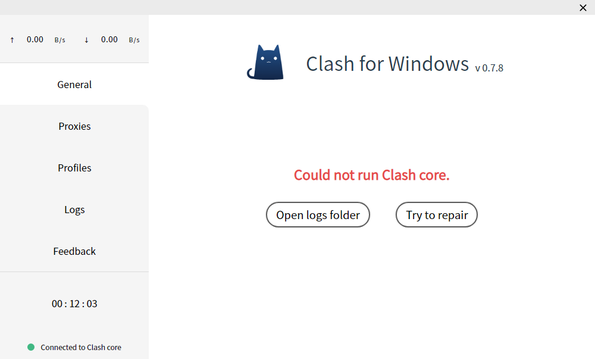

## 配置文件

### 格式

Clash配置文件格式为[YAML]()，具体写法参考：https://github.com/Dreamacro/clash#config

CFW启动的过程会使用到两个配置文件，分别是：

- ``Home Directory/config.yml``
- ``Home Directory/Profiles/xxxx.yml``

#### config.yml


后缀并非.yaml，``Home Directory``目录中存在一份兼容的config.yaml，CFW暂未适配此文件，请保持为空


这是Clash的启动文件，位于``Home Directory``中，如果此文件有错，则Clash核心将无法启动，一般会出现如下界面：



另外，此文件除了支持Clash全部字段写法外，还额外支持三个CFW特定的字段：

- cfw-latency-timeout：延迟测试超时时间（毫秒），默认3000
- cfw-latency-url：延迟测试URL，默认http://www.gstatic.com/generate_204
- cfw-bypass：系统代理绕过域名或地址，参考 [绕过系统代理](bypass.md)
- cfw-conn-break-strategy: 切换节点后或切换配置文件后打断连接，参考 [打断连接](breakconn.md)


此文件关乎Clash核心是否能正常启动，如非必要，请勿更改


#### Profiles/xxxx.yml

Profiles文件夹下文件均由用户导入，CFW统一生成的，一般命名为时间戳

这些文件可以不完整，通常只需要有：``Proxy/Proxy Group/Rule``三个字段组成即可：

```yaml
Proxy:
  - name: Shadowsocks
    type: socks5
    server: 127.0.0.1
    port: 1080
Proxy Group:
  - name: Proxy
    type: select
    proxies:
      - Shadowsocks
Rule:
  - 'MATCH,DIRECT'
```

除此外，还可以添加``dns/hosts``字段，但在使用CFW时不建议添加

### 加载过程

CFW启动流程如下：
1. 使用基础配置文件config.yml启动Clash核心
2. 根据用户上次使用的配置文件（Profiles/xxxxx.yml）进行恢复
3. 恢复用户上次操作的策略情况

#### 解读

步骤1完成后，Clash会按照config.yml设置启动

步骤2完成后，用户配置文件里的``Proxy/Proxy Group/Rule/dns``这几个字段的内容会被替换到Clash里面，除了上面值几个字段，其他的内容均不会替换（这就是Profiles里配置文件可以不完整的原因）

#### 原因

**之所以不进行全替换，是因为每一个配置文件所设定的端口号可能是不一样的，这样每次切换配置文件后，需要重新设置系统代理以及其他软件的代理端口，这显然太麻烦**

所以采用上面的方案，使得用户配置文件以Plugin的方式加载
如果需要修改端口号，只需要在General界面点击Text Edit Mode打开config.yml文件编辑并保存即可，Clash for Windows会在检测到文件变化后自动为你重启Clash核心
