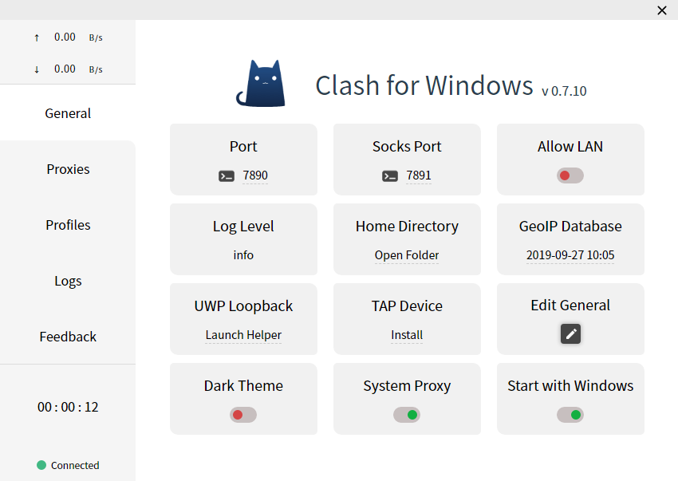
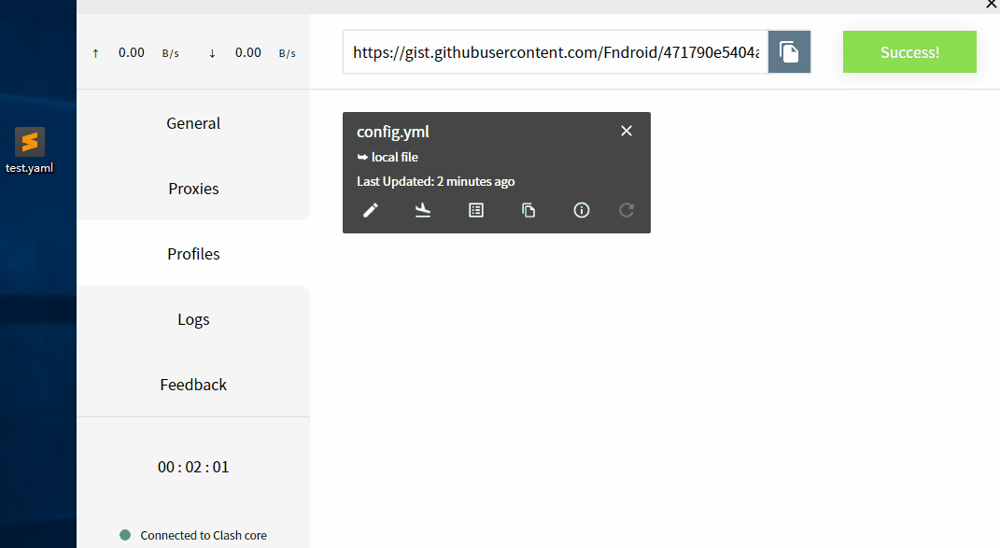
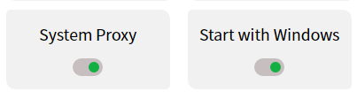

## 快速上手

适用大部分服务商提供Clash托管的用户

### 启动

首次启动Clash for Windows后会出现下图所示界面代表启动成功：

### 导入配置文件

导入配置文件有如下两个途径：
- URL导入
- 本地文件拖拽导入

一般情况下，URL及配置文件都由服务商提供复制或下载

#### URL导入

点击界面左侧菜单Profiles，在顶部输入框填入URL并点击Download即可，下载完成后点击对应的配置文件即可载入

#### 本地文件拖拽导入

如果无法通过URL下载配置文件，则可以尝试在浏览器中下载配置文件后通过拖拽方式导入

### 打开系统代理及开机自启选项

返回General中，打开``System Proxy``及``Starts with Windows``两个开关即可

- System Proxy：设置系统代理
- Start with Windows：开机自启动

### 完成！

现在，基本配置已经完成了

如果对软件进阶部分感兴趣，可以阅读之后的内容